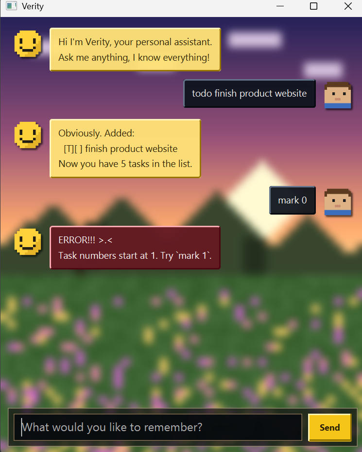

# Verity User Guide

Verity is a desktop task-tracking chatbot, optimized for use via a Command Line Interface
(CLI) while still having a Graphical User Interface (GUI) built with JavaFX. If you can type
fast, Verity can get your task management done faster than traditional GUI apps - and she'll
let you know exactly what she thinks about it.



## Quick start

1. Ensure you have Java `25` or above installed.
2. Download the latest `verity.jar` from the [releases page](https://github.com/Atqui-404/ip/releases).
3. Copy the file to the folder you want to use as the home folder for Verity.
4. Open a terminal in that folder and run:
   ```
   java -jar verity.jar
   ```
   A window similar to the one above should appear in a few seconds. The app already
   contains some sample commands you can try below.
5. Type a command in the input box and press Enter (or click Send) to execute it. Some
   example commands:
   - `list` : lists all tasks.
   - `todo read book` : adds a todo task named `read book`.
   - `delete 1` : deletes the 1st task shown in the current list.
   - `undo` : reverses the most recent change.
   - `bye` : exits the app.
6. Refer to the [Features](#features) below for details of each command.

## Features

**Notes about the command format:**
- Words in `UPPER_CASE` are parameters to be supplied by you, e.g. in `todo DESCRIPTION`,
  `DESCRIPTION` is a parameter, so `todo read book` would give you a todo task named
  `read book`.
- Task numbers refer to the position shown by the most recent `list`/`find`/`on`, starting
  from 1.
- Dates are always given and displayed in `yyyy-MM-dd` format when typed in, e.g. `2019-10-15`
  (shown back to you as `Oct 15 2019`).
- Extra whitespace around a command or its markers is ignored.

### Adding a todo: `todo`

Adds a task with no date/time attached.

Format: `todo DESCRIPTION`

Example: `todo read book`

```
Obviously. Added:
  [T][ ] read book
Now you have 1 tasks in the list.
```

### Adding a deadline: `deadline`

Adds a task that needs to be done by a specific date.

Format: `deadline DESCRIPTION /by DATE`

Example: `deadline return book /by 2019-06-06`

```
Obviously. Added:
  [D][ ] return book (by: Jun 06 2019)
Now you have 1 tasks in the list.
```

### Adding an event: `event`

Adds a task that starts and ends on specific dates. `/from` must come before `/to`, and
the end date cannot be before the start date (a single-day event, where both dates are the
same, is perfectly valid).

Format: `event DESCRIPTION /from START_DATE /to END_DATE`

Example: `event project meeting /from 2019-08-06 /to 2019-08-07`

```
Obviously. Added:
  [E][ ] project meeting (from: Aug 06 2019 to: Aug 07 2019)
Now you have 1 tasks in the list.
```

### Listing all tasks: `list`

Shows every task currently tracked, numbered in the order they were added.

Format: `list`

### Marking a task as done: `mark`

Marks the given task as done.

Format: `mark INDEX`

Example: `mark 2` marks the 2nd task in the current list as done.

### Marking a task as not done: `unmark`

Marks the given task as not done.

Format: `unmark INDEX`

Example: `unmark 2` marks the 2nd task in the current list as not done.

### Deleting a task: `delete`

Removes the given task from the list.

Format: `delete INDEX`

Example: `delete 3` removes the 3rd task in the current list.

### Finding tasks by keyword: `find`

Finds every task (of any type) whose description contains the given keyword. The search is
case-insensitive and matches a partial word.

Format: `find KEYWORD`

Example: `find book` finds `read book` and `return book (by: Jun 06 2019)`.

### Viewing tasks on a date: `on`

Lists every deadline due, or event spanning, a given date. A todo never matches, since it
has no date.

Format: `on DATE`

Example: `on 2019-12-02`

### Undoing the last action: `undo`

Reverses the effect of the most recent `todo`/`deadline`/`event`/`mark`/`unmark`/`delete`
command. Running `undo` repeatedly walks back through everything you've done this session,
one step at a time, in reverse order. Commands that don't change the task list (`list`,
`find`, `on`) are skipped over - they don't count as something to undo, and don't block
undoing something earlier. `undo` itself cannot be undone (there is no redo).

Format: `undo`

### Exiting the program: `bye`

Exits the program.

Format: `bye`

### Saving the data

Task data is saved to disk automatically after any command that changes the task list.
There is no need to save manually.

### Editing the data file

Task data is saved as a text file at `[JAR file location]/data/verity.txt`. Advanced users
are welcome to update the data directly by editing that file - if a line becomes invalid
(e.g. wrong number of fields, an unrecognized task type, or a start date after an end date),
Verity skips just that line with a warning on startup rather than losing the rest of your
data.

## FAQ

**Q**: How do I transfer my data to another computer?

**A**: Install Verity on the other computer, then replace the empty `data/verity.txt` file
it creates with the one from your previous Verity home folder.

**Q**: What happens if I give a command Verity doesn't understand?

**A**: Verity tells you the command wasn't recognized, and lists every command she does
understand. She'll also get progressively more annoyed if you make several mistakes in a
row, regardless of what kind - so read the error message.

## Command summary

| Action | Format | Example |
|---|---|---|
| Todo | `todo DESCRIPTION` | `todo read book` |
| Deadline | `deadline DESCRIPTION /by DATE` | `deadline return book /by 2019-06-06` |
| Event | `event DESCRIPTION /from START_DATE /to END_DATE` | `event meeting /from 2019-08-06 /to 2019-08-07` |
| List | `list` | `list` |
| Mark | `mark INDEX` | `mark 2` |
| Unmark | `unmark INDEX` | `unmark 2` |
| Delete | `delete INDEX` | `delete 3` |
| Find | `find KEYWORD` | `find book` |
| On | `on DATE` | `on 2019-12-02` |
| Undo | `undo` | `undo` |
| Bye | `bye` | `bye` |
